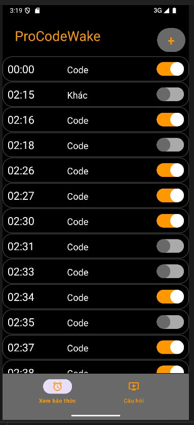
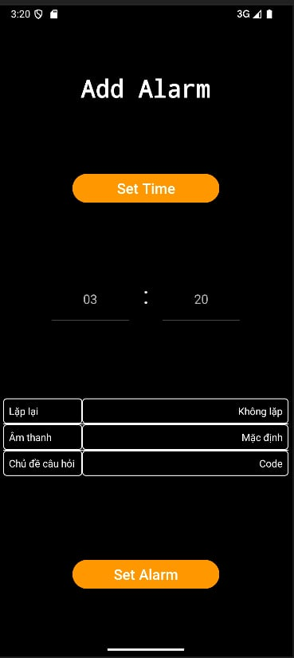
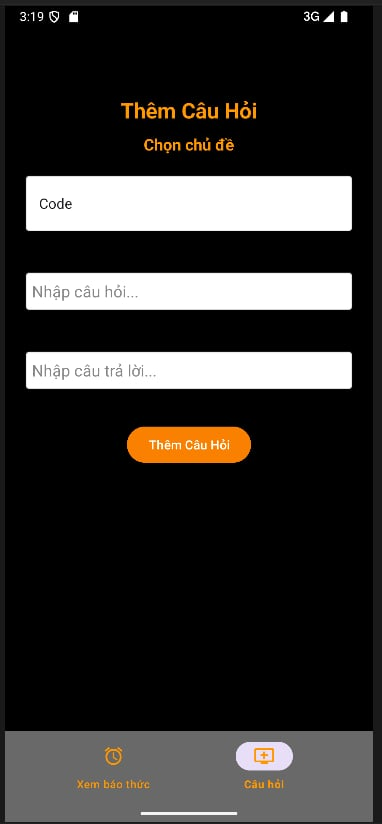
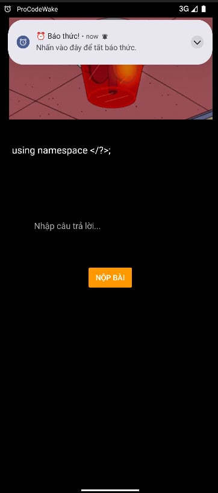

# [ProCodeWake]

Hưởng ứng phong trào "dậy sớm để thành công", chúng tôi đã xây dựng nên 1 app báo thức rất đặc biệt. Khác với các app báo thức thông thường, các bạn phải trả lời câu hỏi để có thể tắt báo thức, việc này sẽ giúp bạn tỉnh táo sau quãng thời gian nghỉ ngơi. Hãy tận hưởng với chiếc app của chúng tôi nhé.

## Authors

- [@HandQ2212](https://github.com/HandQ2212)


## Demo

- [Video Demo ProCodeWake](https://www.youtube.com/watch?v=kaGvThXe4L4&feature=youtu.be)


## Screenshots








## Features

- Chức năng thêm câu hỏi và câu trả lời.
- Đặt báo thức với các thời gian lặp lại, chuông báo và chủ đề câu hỏi.
- Có thể xóa báo thức.
- Chạy ngầm để check, khi có báo thức sẽ hiện thông báo pop-up và âm thanh.


## Requirements

- Java 11.
- Android SDK.
- Lưu trữ dữ liệu JSON và Gson.

## Installation

Cách cài đặt dự án

```bash
  - Đối với máy tính(sử dụng trình giả lập):
    + Các công cụ có thể dùng: Emulator trong Android Studio, trình giả lập bên thứ 3 (Genymotion, BlueStacks, ...)
    + Clone dự án
    + Mở ứng dụng chạy giả lập và chạy trên đó

  - Đối với điện thoại (Path: ProCodeWake\app\build\outputs\apk\androidTest\debug):
    + Tải file APK về máy
    + Mở file APK và chạy
```
Lưu ý đối với dự án
```bash
  - Cần phải cấp quyền thông báo cho ứng dụng:
    + Mở Setting (cài đặt)
    + TÌm tới mục Apps (ứng dụng)
    + Ấn vào app ProCodeWake
    + Cấp quyền thông báo cho ứng dụng
```    
## Mối quan hệ giữa các lớp
- **1.MainActivity:**

  - Là activity chính của ứng dụng, quản lý danh sách báo thức và giao diện người dùng.
  - Sử dụng `TimeAlarmAdapter` để hiển thị danh sách báo thức trong *ListView*.
  - Sử dụng `JsonHelper` để tải và lưu danh sách báo thức từ/đến file JSON.
  - Khởi động `AlarmSchedulerService` để cập nhật báo thức khi ứng dụng mở.
  - Đăng ký `ActivityResultLauncher` để nhận kết quả từ `DatBaoThucActivity` khi người dùng đặt báo thức mới.
  - Sử dụng *BottomNavigationView* để điều hướng giữa các màn hình khác nhau trong ứng dụng.

- **2.TimeAlarmAdapter:**

  - Là *adapter* để hiển thị danh sách báo thức trong *ListView* của `MainActivity`.
  - Sử dụng `TimeAlarm` để lấy dữ liệu báo thức và hiển thị trong các item của *ListView*.

- **3.TimeAlarm:**

  - Là lớp mô tả một báo thức với các thuộc tính như giờ, phút, ngày, trạng thái bật/tắt, đường dẫn âm thanh và chủ đề.
  - Được sử dụng bởi `TimeAlarmAdapter` để hiển thị thông tin báo thức và bởi `JsonHelper` để lưu và tải dữ liệu báo thức.

- **4.JsonHelper:**
  - Là lớp tiện ích để tải và lưu danh sách báo thức từ/đến file JSON.
  - Được sử dụng bởi `MainActivity` để quản lý dữ liệu báo thức.

- **5.AlarmSchedulerService:**
  - Là dịch vụ để lên lịch và quản lý báo thức.
  - Được khởi động bởi `MainActivity` để cập nhật báo thức khi ứng dụng mở.

- **6.AlarmReceiver:**
  - Là `BroadcastReceiver` để nhận sự kiện báo thức và khởi động `WakeUpActivity`.
  - Được sử dụng bởi `AlarmSchedulerService` để gửi broadcast khi đến giờ báo thức.

- **7.WakeUpActivity:**
  - Là activity để hiển thị giao diện báo thức khi đến giờ, phát âm thanh và yêu cầu người dùng trả lời câu hỏi để tắt báo thức.
  - Được khởi động bởi `AlarmReceiver` khi nhận được broadcast báo thức.

## Vấn đề hiện chưa giải quyết được
```bash
- Sửa câu hỏi
- Sửa báo thức
- Switch để tắt bật báo thức
- Giao diện chưa bắt mắt
- Sử dụng nhiều Activity
```

## References
- [@Developer Android: xử lý fxml, service, v.v](https://developer.android.com/)
- [@StackOverFlow: chuyển data qua các binder](https://stackoverflow.com/questions/48443286/android-why-e-javabinder-failed-binder-transaction)
- [@Kênh Công nghệ: học android](https://www.youtube.com/@KenhCongNghe-ThongVo)
- [@Chat GPT: fix bug, sinh log](https://chatgpt.com/)

## License

[MIT](https://choosealicense.com/licenses/mit/)

